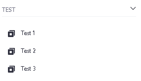
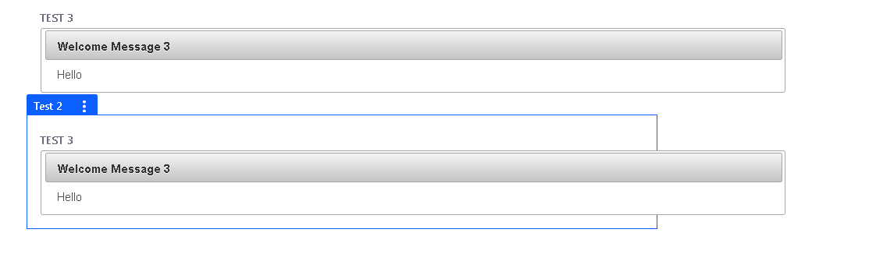
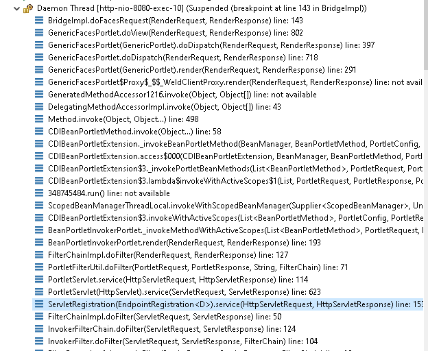

# liferay-multiple-portlet-test

A sample project to find a bug/wrong configuration.

This builds a test.war for Liferay 7.4.3.81 with mvn -P cdi clean install

The test.war is based on

com.liferay.faces.archetype.parent 6.1.1

with Portlet 2.0 and JSF 2.2 and CDI Integation.

It still uses Primefaces 6.1.

# Bug

This project has three portlets Test 1, Test 2 and Test 3

That are shown in the menu.

But if Test 2 is selected, Test 3 is displayed

# Debug

Debugging shows an javax.servlet.http.HttpServlet.service call at line 623,
but HttpServlet has neither in javax.servlet-api-3.0.1.jar nor in  release.port.api-7.4.3.81-ga81.jar that line.

It looks like at least the wrong _title "Test 3" was set in the portletResponse during that call.

